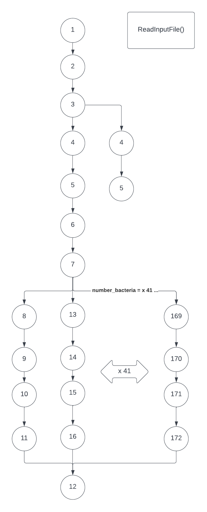

# CVTREE PARALLELISATION

### By Tim Poole
### n10476512
### CAB401 
### Unit Coordinator, Wayne Kelly  

---
## BUILD INSTRUCTIONS  

In order to run and compile this program simply (unzip the file first)
1. open the solution inside of visual studio  
2. uncomment out the version of the program you wish to run, impoved.cpp for the sequential version and final.cpp for the parallel version  
3. if running the parallel version then adjust the number of threads the program will use by adjusting the command 
omp_set_num_threads(x) located in line 287 within the main()  
4. ensure Visual Studio has open MP enabled, do this by right clicking on the project, then 
selecting project settings from the drop down menu, clicking on "All Options",
located within the "C/C++" section, scrolling down to "Open MP Support" and selecting yes 
from the dropdown  
5. lastly click on Debug located in the top menu bar, and from the drop down select Performance Profiler  
6. Tick the "CPU Usage" box and then click start and the program will compile, run, and print the output 
to the console.  

---
## TOOLS & TECHNIQUES USED  

  

I ran all of these tests on my home computer running windows 10 on a Ryzen 5950x Processor which has 16 cores and 32 threads.  

The project itself was run inside of a solution (.sln) inside of Visual Studio. The decision to use Visual Studio was made primarily to 
make use of Visual Studio's inbuilt Performance Profiler. The Profiler was set to monitor CPU usage, and used to test and benchmark 
each iteration of the program from the sequential version (located in improved.cpp), to each iteration of the parallel version 
(located in final.cpp), With the number of threads increased progressively in order to test the affect that more cores, and
thus more threads, would have on the results.

Open Mp was the threading library used to parallelize the program. Included using code below.
```c++
#include <omp.h> 
```
The major command used throughout the program in order to parallelize the program was the omp parallel for command.
```c++
#pragma omp parallel for 
```
This command was used extensively to multithread every instance of a for or nested for loop within the program where 
there was **SUFFICIENT BURDEN** on the CPU to justify its use. However not every for loop required parallelization.
an example of a section where the use of this command
was deemed **UNESSECARY** is outlined below (from lines 13-24 of improved.cpp).  

```c++
#define LEN			6
#define AA_NUMBER		20
#define	EPSILON			1e-010

void Init()
{
	M2 = 1;
	for (int i = 0; i < LEN - 2; i++)	// M2 = AA_NUMBER ^ (LEN-2);
		M2 *= AA_NUMBER;
	M1 = M2 * AA_NUMBER;		// M1 = AA_NUMBER ^ (LEN-1);
	M = M1 * AA_NUMBER;			// M  = AA_NUMBER ^ (LEN);
}
```  

This for loop will only run 6 times as "i" will only go until it is just less than "LEN" which in this case is defined as equal
to 6. The reasoning behind this decision is that the impact of adding parallelization here will either have a negligible or
negative overall impact on the performance of the program. A negative impact would most likely be due to the cost and overhead
of setting up the multithreading in the first place, outwaying the benefits of parallelization on each succesive iteration of the for loop.  

---
## SEQUENTIAL PROGRAM  & POTENTIAL PARALLELISM

The cvtree project, originally developed by Dr Wayne Kelly of the Queensland University of Technology,
is a small sequential application written in C++ that aims to find the similarity between disparite genomes
using frequency vectors. The code (located in improved.cpp) will first read a basic text file called list.txt
containing the number of Bacteria and their names and will stores these names so that it can then retrieve the relevant data
from each bacteria's corresponding fasta file located within the data directory. Each fasta file is an Bacteria and consists of many genes, each gene
in turn is comprised of many proteins called amino acids. There are 20 commonly occuring amino acids each represented by a letter of 
the alphabet. Instead of comparing each bacteria's genes, parts of the genomes called K-mers can be used to statistically determine
'how closely related the bacteria are to one another. a K-mer is a sub-section of a gene and the K represents the number of amino acids
that are grouped together for analysis. In this case Dr Kelly has used 6-mers to group together the amino acids and traverse the gene. 

the original sequential application (sourcecode located in improved.cpp) begins execution within the main function
(code snippet included below)  

```c++
int main(int argc,char * argv[])
{
	time_t t1 = time(NULL);

	Init();
	ReadInputFile("list.txt");
	CompareAllBacteria();

	time_t t2 = time(NULL);
	printf("time elapsed: %lld seconds\n", t2 - t1);
	return 0;
}
```  
The folowing diagram concisely sums up the key components of the main function and helps to further
breakdown the program into its 3 major sections, the Init, ReadInputFile and CompareAllBacteria
Functions.  

  

Each of These functions can further be broken down into their respective flow control diagrams and their individual data dependencies deduced.
This is a lengthy process and these diagrams consume a large amount of space in the report so that have been included in the appendice at the
end of the report.  

The Init function adds 9 equal weighted steps to the exectution of the program and while, this section can be easily parallelized
to create a shortest path of 4, as discussed above in the previous section (Tools and techniques), this is totally unessecary and
could hurt the overall performance of the program.  

The next function is ReadInputFile. Sequentially after analysing the data depeendencies this function adds 172 equally weighted steps to the program.
mostly this is due to a for loop which iterates through "number_bacteria" times, which in this case was 41. Within the for loop was 4 equally weighted steps
so the for loop is responsible for 164 of the previously mentioned 172 steps. Theoretically the shortest path through the function with infinite processors
is 12 steps. In practise, as my machine only has 32 threads, the for loop would need to be completed in 2 passes assuming ideal conditions where the threads
all execute at once and then again immediately after. This would result in the shortest path on my machine with 32 threads being 16 steps.  

Lastly and most impactful of all is the CompareAllBacteria function. After an array of pointers to Bacteria is created, there are 2 major flow control areas
that greatly affect the execution time of the program. The first is a basic for loop that executes "number_bacteria" times, which is 41, and each time most
noticeably declares a new Bacteria. This is significant as the bacteria class contains many data dependencies and numerous flow control statements
such as while and for loops which may account for a large percentage of the programs execution time.  

Furthermore, the second major part of the CompareAllBacteria function is the double or nested triangle for loop which executes approximately number_bacteria<sup>2</sup> / 2 times and runs the CompareBacteria function every iteration.   

CompareBacteria itself also contains numerous data dependencies and greatly increase the execution time of the program. Admittedly I struggled to analyse the
data dependencies beyong the overall view of CompareAllBacteria. In the data dependency diagram for CompareAllBacteria I have generally assigned an equal
weighting to all operations that take place inside the for loops however realisticaly Declaring a new Bacteria and CompareBacteria should have been weighted
far more.  

Immediately both major parts of CompareAllBacteria stand out as prime candidates for parallelisation, specifically because they contain computantionally intensive
functions and iterate over them many times.

---
## CHALLENGES  

The greatest challenge that I faced during this project was figuring out how the sequential program worked, and more sepcifically
how the data dependencies flowed 
throughout the program, detangelingling the web of nested functionality. Furthermore I struggled initially to
understand which parts of the program could even be parallezied succesfully, mostly due to the previously mentioned data dependency problem and wether 
or not those parallel regions would require synchronisation or could be performed out of order. I solved this problem by using Visual
Studios debugging capabilities to step through the code so I could follow the main thread as it executed the code and used the Profiler to see where
the program was spending the most amount of time.   

---
## THE SOLUTION  

In order to parallelize the program, I chose to make a few minor changes to the main and CompareAllBacteria functions only.  

Firstly I chose to insert the command "# pragma omp parallel for" **before** the first for loop. Next I chose to insert another 
"# pragma omp parallel for" **after** the first for and **before** the nested for in the triangular for loop. Initially I read online
that for a nested for loop it is optimal to put the command outside of the entire nested loop and Open MP with naturally
configure the best solution, However in testing I found placing the command only before the second for statement to be 
best solution with the fastest time. This may have been due to the nested for loop being triangular instead of rectanglar. 
I also chose to replace the print statements within the parallel region with a line
that would place the results into a 2 dimensional array declared and intialized prior. The reasoning behind this decision was that I/O operations are 
poorly optimized and are best left outside parallel regions. Furthermore, in this instance I deemed it more realistic that the results would
be stored in an array and then printed later as opposed to always needing to be printed every time the program is run. 
Overall, these changes did not require much reconfiguration of the existing code nor did any pre existing algorithms needed
to be adjusted.

```c++
void CompareAllBacteria(double** array)
{
	time_t t1 = time(NULL);

	Bacteria** b = new Bacteria * [number_bacteria];

# pragma omp parallel for
	for (int i = 0; i < number_bacteria; i++)
	{
		printf("load %d of %d on thread %d of %d threads using, with %d threads total\n", i + 1, number_bacteria, omp_get_thread_num(), omp_get_num_threads(), omp_get_num_procs());
		b[i] = new Bacteria(bacteria_name[i]);
	}

	time_t t2 = time(NULL);
	printf("time elapsed: %lld seconds,  finished loading Bacteria\n", t2 - t1);


	for (int i = 0; i < number_bacteria - 1; i++)
# pragma omp parallel for
		for (int j = i + 1; j < number_bacteria; j++)
		{
			//printf("%2d %2d -> ", i, j);
			double correlation = CompareBacteria(b[i], b[j]);
			//printf("%.20lf on thread %d of %d threads on %d cors\n", correlation, omp_get_thread_num(), omp_get_num_threads(), omp_get_num_procs());
			array[i][j] = correlation;
		}
}
```  

Similarly, while main appears quit different to its original state it did not require extensive reconfiguration. The only chnages added are simply
a for loop located between the ReadInputFile and CompareAllBacteria functions which is present create the previously mentioned 2 dimensional array
which due to poor 2 dimensional array support in C++ is actually an array or pointer of arrays or pointers to doubles. The only other addition was 
a triangular nested for loop taken directly from the code above which exists to print out the contents of the array to ensure the results are in
fact accurate. Lastly the command "omp_set_num_threads(x)" is present within main. This command dictates to Open MP how many threads should be used
when executing the program and for the sake of simplicity I chose to put it once inside of main so that it would propogate to every Open MP command
that would execute further down (which is all of them).

```c++
int main(int argc, char* argv[])
{

	time_t t1 = time(NULL);
	omp_set_num_threads(10);

	Init();
	ReadInputFile("list.txt");
	double** array = new double* [number_bacteria];

	for (int i = 0; i < number_bacteria; i++) {
		array[i] = new double[number_bacteria];
	}
	CompareAllBacteria(array);

	time_t t2 = time(NULL);
	printf("time elapsed: %lld seconds,  finished analysis completely\n", t2 - t1);
	// time not required after this p;oint as the data has
	// already been saved in the array
	for (int i = 0; i < number_bacteria - 1; i++)
		for (int j = i + 1; j < number_bacteria; j++)
		{
			double x = array[i][j];
			printf("%2d %2d -> %.20lf\n", i, j, x);
		}
	return 0;
}
```

---
## RESULTS  

The Sequential program running as a single process with a single thread was able to execute on my desktop
computer at home in 37 seconds and only used 3% of the total CPU power available on the machine as it was
bound to only one thread.  

|   No. Threads |  No. Cores |Execution Time (s)  |  CPU % Utilization  |  Speed Up Achieved  |
|---------------|------------|-----------------------|------------------|---------------------|
|  1            | 1          | 37                    |         3        |      N/A            |  

This is in stark contrast to the speed up achieved by using 4 cores or more. Specifically the best results
which were produced when using 12 cores which sped up execution time by a factor of x3.  

|   No. Threads |  No. Cores  |Execution Time (s)  |  CPU % Utilization  |  Speed Up Achieved  |
|----------|------|-----|-----------------------|-------------|
|  2       |   1   | 21  |         6            |      1.761     |
|  4       |   2   | 19  |         13           |      1.947     |
|  6       |   3   | 13  |         18           |      2.846     |
|  8       |   4   | 13  |         25           |      2.846     |
|  10      |   5   | 13  |         32           |      2.846     |
|  12      |   6   | 13  |         38           |      2.846     |
|  16      |   8   | 13  |         50           |      2.846     |
|  20      |   10  | 13  |         63           |      2.846     |
|  24      |   12  | 12  |         75           |      3.083     |
|  28      |   14  | 13  |         89           |      2.846     |
|  32      |   16  | 13  |         100          |      2.846     |

From the spoeedup graph below, a strange phenomenon can be observed.  

  

While adding more cores does increase performance, there seems to be drastically diminishing returns beyond a certain point.
This begs the question, why did more processing power not continue to deliver better results in a linear fashion? To answer this question
I have provided the Performance Profilers CPU % graphs obtained from bechmarking the sequential, 1, 2, 3 and 12 core run throughs of the program
respectively.  

  
  
  
  
  

Besides their obvious difference in overall execution time, these graphs illustrate a clear trend.
As you can see the sequential graph mostly appears to be a flat line from start to finish, which was entirely expected. However as
the number of cores available increases the program as a whole executes in less time, but more interestingly 2 distinct zones appear.
the first zone on the left side of each of the parallelized graphs appears flatter, while the right "hump" appears more densely packed.
I choose to explain this phenomenon with an analogy. This program is like a piece of string and the length of that string when it is stretched 
out is akin to the total time it takes for the program to fully execute.  

  

The string starts out like the sequential program and is layed out flat,
but if you were to place you finger on both ends and push them closer together a rising hump would be created and the distance between the two ends of
the string would be closer together.  

  

The string rises higher off of the table it was previously pressed against. In this example the height of the string
off of the table at any point along the table is analogous to the % CPU power being used in the above graphs, and the distance between the two ends of the string
represents the difference between when the program starts and finishes, essentially the execution time.  

This is why i chose to add an extra print statement in the middle of the CompareAllBacteria function so that I could analyse the area identified
as being the hottest parallel region.

One potential issue that did arise from threading the program was the potential corruption of data accuracy due to a lack of synchronisation. 
This is because threads are able to execute out of order.
I needed to determine if this was in fact a problem. Theoretically, due to the formula that calculates correlation only operating using 
addition, I did not foresee any issues arising as a results of stringent order of operations. Furthermore, because my changes to the code utilized an
array, and used coordinate values "i" and "j" to populate the array out of order and then a final nested for loop at the end of the main function 
to read the results in order, I was certain there would be no problems. Nonetheless, I scrutinized the output of each parallel version othe code against
the output of the sequential program and, using "i" and "j" to match results, found no difference. Therefore the results found by the report are valid. 
To see the output produced by each run through of the program, simply navigate to the results directory and look in the aptly named ".txt" file for the
relevant run through. Furthermore, the diagnostic reports suffixed by ".diag", produced by the performance profiler for each run through of the program 
can also be found in the same directory.

---
## OUTCOME  

This project has yielded a few major learning outcomes for me. Firstly, prior to using Open MP I had only used
the POSIX thread library (pthreads.h) which is an explicit threading library. Explicit Libraries put more
of the onus on the programmer to manually configure each thread and the memory associated with them. This
allows for much more granular control over how the program is threaded, however explicit threading libraries are
far more difficult to implement and debug, consuming far more of the prgrammers time and energy. In comparison I have been pleasantly 
surprised by how easy and effective implementing Open MP has been. Furthermore the resources online about Open Mp
seem far more accesible to programmers with lower levels of competancy and are generally easier to access, 
which is not the case with pthreads.  

Furthermore I have enjoyed learning about how to analyse flow control within a program and follow the data dependencies to
determine where best to apply parallelism to achieve higher performance. Previously when developing programs I **NEVER** stopped
to consider that by default most if not all applications are developed sequentially without taking into consideration parallelism 
and thus many programmers are leaving otherwise fairly achievable performance "on the table".  

The final speedup achieved was approximately a x3 increase. This is a fairly 
good increase in speedup however I did expect that with more cores the speedup would have continued to increase
further instead of stabilising so quickly after only 3 cores. This however probably highlights that more parallelism could
have been added to the first half of the problem where the speedup was less impressive. However, this could also 
be the result of a small data set. The area I identified as most computational intensive received the biggest increase in
performance. If this test were to be performed on a larger dataset, for example 400 bacteria as opposed to only 41,  I strongly 
believe the difference between the sequential
program and the parallel programs would have been far greater. Furthermore I beleive that the difference would hasve grown exponentially. 
It is my hypothesis that more cores do make a significant difference but in this limited experiment were not fully utilized.  

Beyond trying to further improve the program's performance with parallelism using Open MP, This report could
be extended in future to compare the speedup achieved by an implicit threading library, like "Open MP", vs an Explicit 
threading Library such as "Microsoft Windows Native threads". Such a comparison would be really insightful as it could
help programmers understand the pros and cons of each approach and wether or not investing more time into using explicit
threading is worth the hassle.

---
## APPENDICE

### Init  

```c++
void Init()
{
	M2 = 1;
	for (int i=0; i<LEN-2; i++)	// M2 = AA_NUMBER ^ (LEN-2);
		M2 *= AA_NUMBER;
	M1 = M2 * AA_NUMBER;		// M1 = AA_NUMBER ^ (LEN-1);
	M  = M1 *AA_NUMBER;			// M  = AA_NUMBER ^ (LEN);
}
```  

  

### ReadInputFile  

```c++
void ReadInputFile(const char* input_name)
{
	FILE* input_file;
	errno_t OK = fopen_s(&input_file, input_name, "r");

	if (OK != 0)
	{
		fprintf(stderr, "Error: failed to open file %s (Hint: check your working directory)\n", input_name);
		exit(1);
	}

	fscanf_s(input_file, "%d", &number_bacteria);
	bacteria_name = new char*[number_bacteria];

	for(long i=0;i<number_bacteria;i++)
	{
		char name[10];
		fscanf_s(input_file, "%s", name, 10);
		bacteria_name[i] = new char[20];
		sprintf_s(bacteria_name[i], 20, "data/%s.faa", name);
	}
	fclose(input_file);
}
```  

  

### CompareAllBacteria  

```c++
void CompareAllBacteria()
{
	Bacteria** b = new Bacteria*[number_bacteria];
	for(int i=0; i<number_bacteria; i++)
	{
		printf("load %d of %d\n", i+1, number_bacteria);
		b[i] = new Bacteria(bacteria_name[i]);
	}

	for(int i=0; i<number_bacteria-1; i++)
		for(int j=i+1; j<number_bacteria; j++)
		{
			printf("%2d %2d -> ", i, j);
			double correlation = CompareBacteria(b[i], b[j]);
			printf("%.20lf\n", correlation);
		}
}
```  


